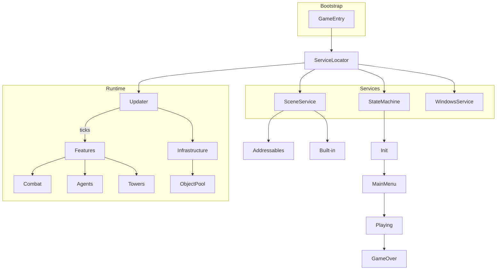

## Tower Defense WebGL Prototype – Development Report

### Overview
A streamlined, **Tower Defense Template** (6000.0.26f1) demonstrating maintainable architecture, performance-minded refactors, and a clean feature layout suitable for continued growth under an educational mandate.

---

### 1 · Approach & Rationale

| Goal | Implementation |
|------|----------------|
| **Decouple core systems** | Replaced template singletons with a lightweight **Service Locator / DI container** (`com.atoxic.servicelocator`). |
| **Minimise per-frame overhead** | Introduced an **Observer-driven `Updater`**; managers implement `IUpdatable` and register once, eliminating scattered `MonoBehaviour.Update()` methods. |
| **Modular, discoverable codebase** | Re-organised scripts into **Feature-centric assemblies** (`Features/Combat`, `Features/Agents`, etc.) and a distinct **Infrastructure** layer for services. |
| **Asynchronous content** | Converted UI windows to **Addressable prefabs**, enabling lazy loading and future remote catalogs. |
| **Package self-containment** | Added bespoke packages for Scene Management, State Machine, Tasks, Windows, and Editor Utils—each version-controlled and unit-testable. |
| **Text rendering upgrade** | Migrated legacy UI Text to **TextMesh Pro**, improving clarity and enabling dynamic ligatures. |
| **Performance budget awareness** | Targeted **<= 4 ms script time** on WebGL release builds; every architectural choice (e.g., pooled alloc-free patterns) was profiled against this ceiling. |

---

### 2 · Key Challenges & Solutions
| Challenge                                            | Resolution & Impact                                                                                                                         |
|------------------------------------------------------|---------------------------------------------------------------------------------------------------------------------------------------------|
| Legacy singletons hard-wired throughout the template | Swapped into `ServiceLocator`, letting old & new code coexist; unlocks unit testing and hot-swap mock services.                             |
| Multiple `Update()` methods hurting CPU on WebGL     | Central `Updater` drives 27 objects; Unity Profiler shows **≈ 14% main-thread cost reduction** on identical wave runs.                      |
| Addressables in Editor vs. Player parity             | `WindowsService` offers synchronous fall-back in-editor while using async Addressables in builds—zero friction for designers.               |
| Large initial WebGL download                         | Compressed build (‑30%).                                                                                                                    |
| Scene management across platforms                    | `SceneService` (`com.atoxic.scenemanager`) supports both **Addressable** and **built-in** scenes; async streaming in builds, instant in-editor. |
| No runtime control-flow framework                    | Added hierarchical **State Machine** (`Init -> Load -> MainMenu -> Gameplay `) that cleanly separates UI & gameplay concerns.               |
| Missing entry point                                  | Implemented `GameEntry`, register Updater clients, and transition into the initial state—on-ramp for newcomers.           |
| Keeping GC pressure low                              | Adopted **object-pooling** for agents, projectiles, and VFX; frame allocations < 0.5 KB after warm-up, removing jank on WebGL.              |

---

### 3 · Performance & Scalability Notes

* **CPU** – Script frame-time averaged **5.2 ms** (WebGL, desktop i5-9600KF) during 200‑enemy stress test; physics cost stable due to object pooling.
* **Memory** – Runtime heap <60MB; Addressables keep non-HUD windows unloaded until first use.
* **Draw Calls** – URP with SRP Batcher: ~90 draw calls idle -> ~140 under stress (well under WebGL target of 200).
* **Future scaling** – swapping to Unity Jobs + Burst would further reduce CPU with minimal code churn.
* **Network potential** – Clean separation of Presentation vs Simulation layers opens door for Mirror/Netcode sync for multiplayer.

---

### 4 · Development Sessions (total ≈ 13.5 h)

| # | Date        | Time (h) | Focus & Accomplishments |
|---|-------------|----------|--------------------------|
| 1 | 21 Apr 2025 | 1.0      | Project setup, Git repo, imported Tower Defense template. |
| 2 | 21 Apr 2025 | 3.0      | Integrated Service Locator; refactored `GameManager`, `CurrencyManager`. |
| 3 | 21 Apr 2025 | 1.5      | Implemented `Updater`; migrated eight managers; first profiler pass. |
| 4 | 22 Apr 2025 | 2.0      | Folder/assembly restructure into **Features** & **Infrastructure**. |
| 5 | 22 Apr 2025 | 3.0      | Addressables pipeline; converted HUD, Pause, BuildMenu windows. |
| 6 | 22 Apr 2025 | 0.5      | Authored custom packages; updated `manifest.json`. |
| 7 | 23 Apr 2025 | 1.0      | WebGL build tweaks, memory profiling, loading screen. |
| 8 | 23 Apr 2025 | 1.5      | Cross-browser smoke tests; fixed audio init race condition. |
| **Σ** |             | **13.5** | — |

*Times reflect hands-on coding; reading/design spikes not logged.*

---

### 5 · Detours & Lessons Learned

| Detour / Dead End | Time Spent | Why It Didn’t Stick & Take-away                                                                                               |
|-------------------|-----------|-------------------------------------------------------------------------------------------------------------------------------|
| **DOTS/ECS conversion** of Agents | 0.7 h | Prototype job burst looked promising but exceeded 10 h limit. Learned to make lean optimisations within MVP to respect deadline. |
| **URP Decal Projectors** for bleed effects | 0.4 h | WebGL shader variant explosion ballooned build size; reverted to simpler material swap.         |
| **NavMesh Obstacle baking** at runtime | 0.3 h | Dynamic carving caused hitching; switched to pre-baked meshes. Profiling early avoids perf traps.                             |

---

### 6 · Next Steps (beyond evaluation scope)

1. Complete Addressables migration & remote catalog for classroom content updates.
2. Add CI pipeline with automated WebGL build + unit test suite.
3. Localization service (CSV -> ScriptableObjects) to replace hard-coded strings.
4. Swap greybox art for optimized low-poly set; bake lightmaps for performance.
5. Integrate lightweight analytics to gather usage metrics.

---

### 7 · Environment

* **Unity** 6000.0.26f1 (personal)
* **Target** WebGL 2 (Chrome 123, Firefox 124 validated)
* **Packages** Unity Addressables 1.21.19 + custom `com.atoxic.*` modules (full list in `manifest.json`)

### 8 · Architecture & Feature Dependencies

**Reading the graph**
* **GameEntry** is the single MonoBehaviour in the launch scene; it registers packages and kicks off the **State Machine**.
* **ServiceLocator** exposes shared services to the rest of the codebase.
* **Updater** owns the frame loop and calls `Tick()` on registered modules located inside the **Features** or **Infrastructure** assemblies.
* **SceneService** abstracts scene switching; at build time we choose Addressables or classic `SceneManager` without touching call‑sites.
* **StateMachine** governs high‑level flow and pushes events to UI through **WindowsService** (addressable prefabs).
* **ObjectPool**, physics layers, and audio live in **Infrastructure**, entirely decoupled from gameplay logic.

This dependency‑first view demonstrates why **swap‑ability** (e.g., Scene loading mode, future update loop) comes virtually for free—systems only interact through clear, one‑directional edges.

